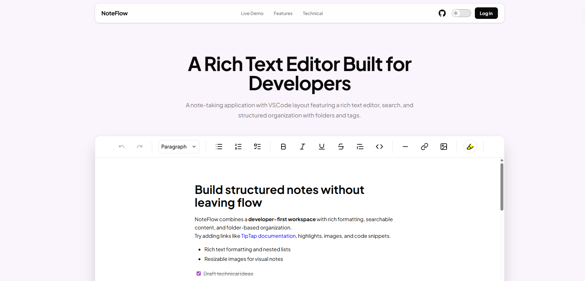
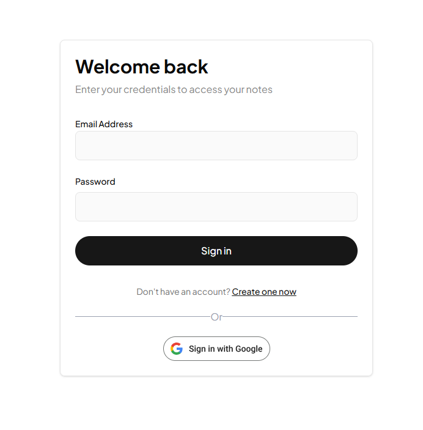
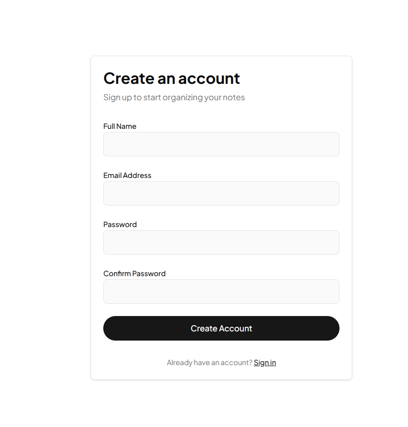
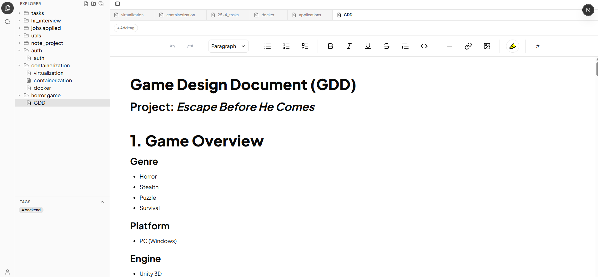
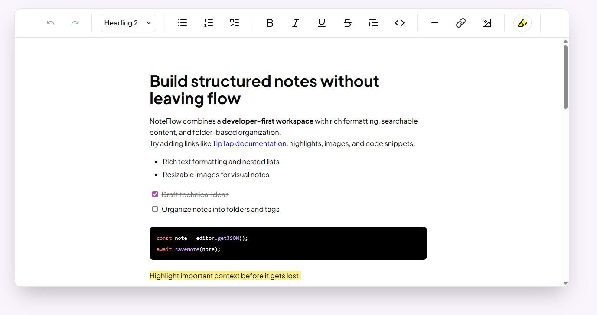
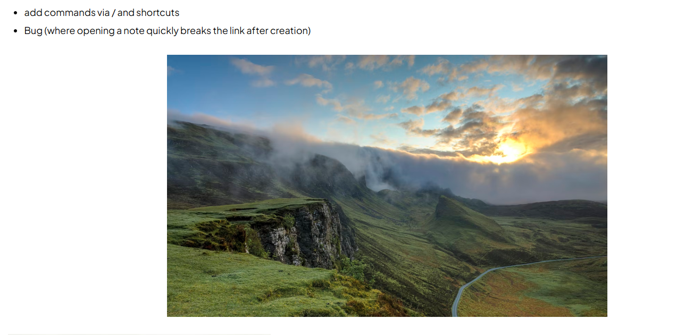
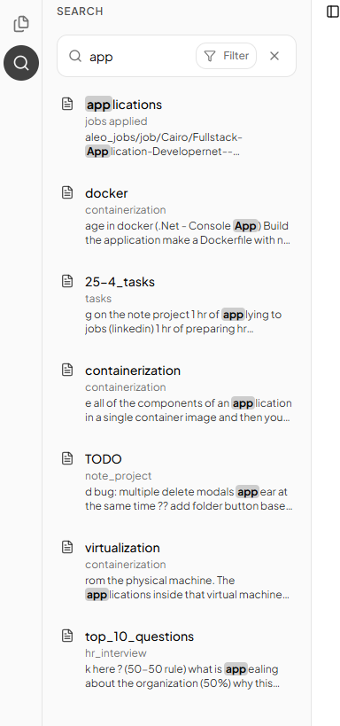
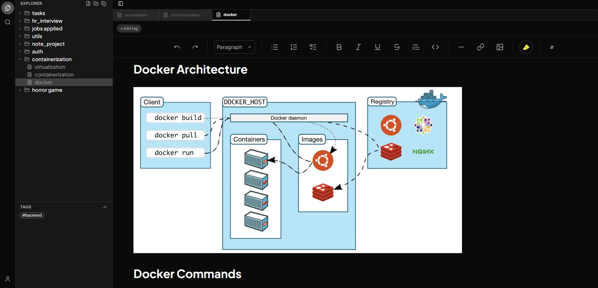
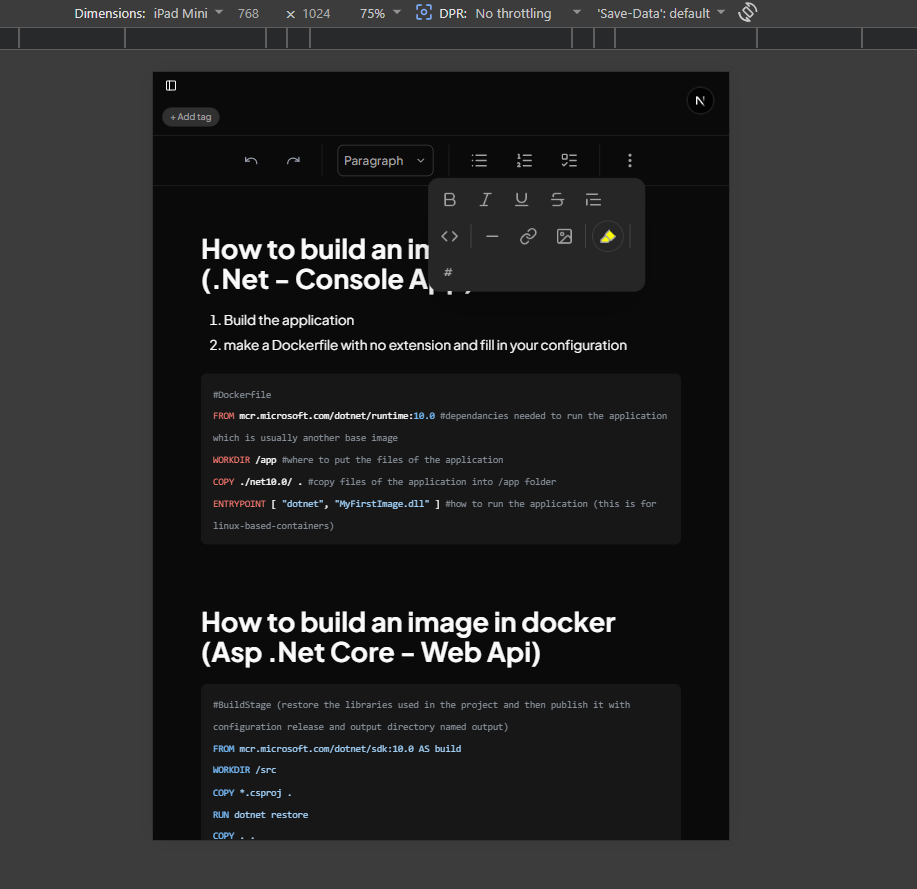

# Note Management App

A full-stack note management application that allows users to create, manage, and track their daily notes with a clean and responsive UI.

Built with a Next.js frontend and a ASP.NET Core backend.

---

## Screenshots:






---

## Tech Stack

- **Frontend:** NextJs, Shadcn and Tailwind
- **Backend:** ASP.NetCore Web Api
- **DataBase:** SQL Server, EF Core and Dapper

---

## Features

- Rich Text Editor
  - Built with Tiptap
  - Supports formatting, lists, code blocks, links, and images
  - Drag & drop + paste image support
  - Auto-save with debounce + safe flush on exit

    

    

- Notes Organization
  - Folder-based system with drag & drop between folders
  - Context menu for create / rename / delete
  - Tagging system for better organization

- Search & Navigation
  - Full-text search (title + content, weighted relevance)
  - Tag-based filtering
  - Multi-tab navigation between notes



![3 taps [virualtization, docker, containerization]](./screenshots/tabs.png)

- UI / UX
  - VS Code–inspired layout (Explorer + Search panels)
  - Fully responsive + collapsible sidebar
  - Dark mode support





- Backend
  - JWT + Refresh Token authentication + Google OAuth
  - SQL Server (EF Core + Dapper + stored procedures)
  - Background jobs with Hangfire (cleanup tasks)
  - Optimized search via parsing editor content
  - Rate limiting + global exception handling
  - Structured logging with Serilog

---

## Setup

### Prerequisites

- Node.js
- .NET 10
- SQL Server

### Clone the Repository

```bash
git clone https://github.com/BelalHashem007/NoteApp-Mono.git
```

### Backend Setup (ASP.NET Core)

```bash
cd backend
dotnet restore
```

Update your appsettings.json

```json
"ConnectionStrings": {
  "DefaultConnection": "your-sql-server-connection-string"
}
```

Update your usersecrets

```json
{
  "JwtBearer:LifeTime": "30",
  "JwtBearer:Issuer": "https://localhost",
  "JwtBearer:Audience": "https://localhost",
  "JwtBearer:SigningKey": "your-sigining-key",
  "Authentication:Google:ClientId": "Google ClientId",
  "Authentication:Google:ClientSecret": "Goodle ClientSecret"
}
```

Run Migrations & start app

```bash
dotnet ef database update
dotnet run
# will run on
http://localhost:5001
```

### Frontend Setup (Next.js)

```bash
cd frontend
npm install

# run
npm run dev

# will run on
http://localhost:3000
```
